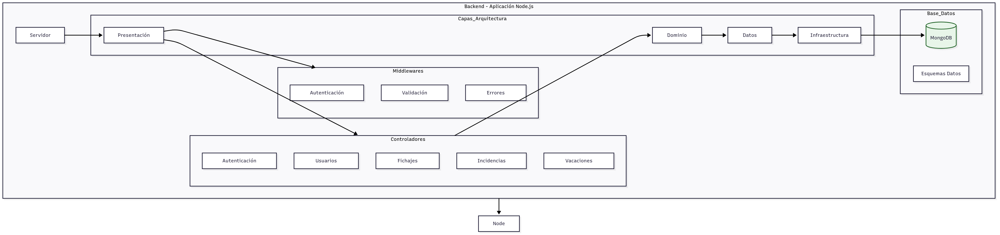
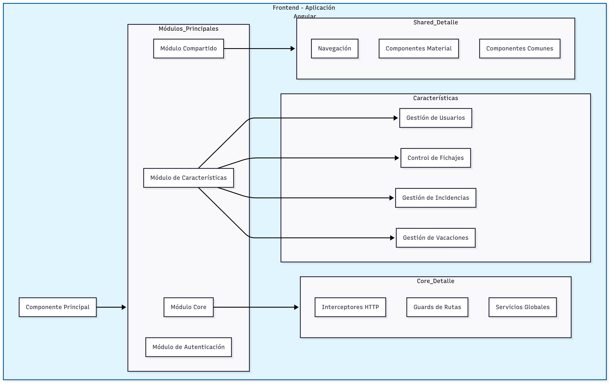

# 1\. Introducción

La gestión de horarios, días festivos y vacaciones en el entorno empresarial actual requiere soluciones robustas y eficientes. La presente propuesta tiene como objetivo desarrollar una aplicación web capaz de gestionar el fichaje de empleados de forma precisa y segura.
Este proyecto nace con el propósito de cubrir la necesidad de una herramienta de gestión del tiempo basada en las mejores prácticas del desarrollo de software, que garantice escalabilidad y accesibilidad. De este modo, se busca ofrecer una solución comercializable a organizaciones que demandan una gestión avanzada del tiempo laboral de sus empleados.

### Motivación Personal

Personalmente busco avanzar desde un rol de maquetación web hacia un perfil full-stack, saliendo de mi zona de confort para desarrollar soluciones tecnológicas completas y escalables.

# 2\. Objetivos

- Registro de fichajes: Permitir que los empleados registren sus entradas y salidas de forma intuitiva. ✅

- Visualización de información laboral: Mostrar de forma clara los días festivos, vacaciones asignadas y horas trabajadas. ❕❗

- Sistema de autenticación: Implementar un mecanismo de seguridad (JWT y Bcrypt) que garantice que solo empleados autorizados accedan a sus datos. ✅

- Arquitectura escalable: Diseñar la solución para facilitar futuras ampliaciones (nuevos módulos, integraciones, etc.). ✅

- Compatibilidad multiplataforma: Asegurar que la aplicación funcione correctamente en diversos dispositivos. ❕❗

## Historias de Usuario {#historias-de-usuario}

- ##### Historia 1: Registro de entrada y salida ✅

  Como empleado. _Quiero registrar mis horas de entrada y salida a través de un botón en mi panel personal para que se contabilice mi jornada laboral de forma precisa_

  Criterios de aceptación*:*

1. La interfaz muestra botones claramente identificados para “Check-in” y “Check-out”.
2. Al pulsar uno de estos botones, se genera un registro en la base de datos con la fecha y hora actuales.
3. Se muestra un mensaje de confirmación tras el registro exitoso.

- ##### Historia 2: Visualización del estado actual de fichaje ✅

  Como empleado. _Quiero visualizar en mi panel los registros del día (entrada y, si procede, salida) para que pueda confirmar que mi jornada se está registrando correctamente_

  Criterios de aceptación*:*

1. El panel muestra claramente la hora de entrada y, de haberla, la de salida.
2. Si falta el registro de salida, se destaca para que el usuario lo complete.
3. La información se actualiza en tiempo real tras cada acción.

- ##### Historia 3: Calendario de días festivos y vacaciones (Futuro) ⏳ planificado

  Como empleado. _Quiero consultar un calendario que indique los días festivos y mis vacaciones aprobadas para que pueda planificar mis actividades y gestionar mi tiempo eficientemente_

  Criterios de aceptación:

1. El calendario es accesible desde el panel de control.
2. Se distinguen visualmente los días festivos (por ejemplo, con un color específico o ícono) y los días de vacaciones personales.
3. La información se actualiza automáticamente en función de las aprobaciones.

- ##### Historia 4: Reporte de asistencia para administración (Futuro) ⏳ planificado

  Como administrador o responsable de RRHH. _Quiero generar un reporte que resuma las horas trabajadas, días festivos y vacaciones de los empleados para que se pueda realizar la gestión de nómina y evaluaciones de desempeño_

  Criterios de aceptación:

1. La herramienta permite filtrar por empleado, departamento y rango de fechas.
2. Se muestran totales resumidos y desgloses por período.
3. Sistema de autenticación
4. Valorar que el reporte se pueda exportar en formatos estándar.

- ##### Historia 5: Registro de nuevo usuario ✅

  Como nuevo usuario. _Quiero registrarme proporcionando mis datos personales y de contacto para que se cree mi cuenta de forma segura en el sistema_

  Criterios de aceptación:

1. El formulario de registro valida campos obligatorios (correo, contraseña, etc.).
2. La contraseña se cifra utilizando Bcrypt.
3. Se confirma el registro mediante un mensaje o redirección a la pantalla de login.

- ##### Historia 6: Inicio de sesión seguro ✅

  Como usuario registrado. Quiero iniciar sesión introduciendo mi correo y contraseña para que pueda acceder a mi panel personal a través de un mecanismo seguro basado en JWT

  Criterios de aceptación:

1. Al introducir credenciales válidas, se genera un token JWT que se almacena en el localStorage.
2. Se muestran mensajes de error en caso de credenciales incorrectas.

- ##### Historia 7: Interfaz responsive y accesible ❕❗

  Como usuario. _Quiero que la aplicación se adapte correctamente a distintos dispositivos para que pueda utilizar el sistema de manera cómoda desde cualquier dispositivo_

  _Criterios de aceptación_:

1. La interfaz desarrollada con Angular y Angular Material se adapta a diferentes resoluciones.
2. Se realizan pruebas de usabilidad en varios navegadores y dispositivos.
3. Se cumplen las pautas de accesibilidad básicas (WCAG 2.1).

---

# 3\. Descripción técnica

### a. Arquitectura & stack

- **Backend**: Node 22, Express, MongoDB (Mongoose), Clean Architecture.
- **Frontend**: Angular 19, Angular Material, RxJS, JWT Guards.
- **Infra**: Docker, Render (API), Vercel (SPA), Mongo Atlas.

* Backend:. [https://github.com/lenvigo/janoo-back](https://github.com/lenvigo/janoo-back)

* Frontend: [https://github.com/lenvigo/janoo-front-app](https://github.com/lenvigo/janoo-front-app)

## 3.1 Backend: REST Server con Clean Architecture

src/
├── presentation/ \# Capa de presentación
│ ├── auth/ \# Autenticación
│ ├── checkin/ \# Control de asistencia
│ ├── incident/ \# Gestión de incidencias
│ ├── schedule/ \# Programación
│ ├── user/ \# Gestión de usuarios
│ ├── vacation/ \# Gestión de vacaciones
│ ├── middlewares/ \# Middlewares personalizados
│ ├── routes.ts \# Definición de rutas
│ └── server.ts \# Configuración del servidor
│
├── domain/ \# Capa de dominio
│ ├── datasources/ \# Fuentes de datos
│ ├── dtos/ \# Data Transfer Objects
│ ├── entities/ \# Entidades del dominio
│ ├── errors/ \# Errores personalizados
│ ├── repositories/ \# Interfaces de repositorios
│ ├── use-cases/ \# Casos de uso
│ └── index.ts \# Exportaciones del dominio
│
├── infrastructure/ \# Capa de infraestructura
│ ├── datasources/ \# Implementaciones de fuentes de datos
│ ├── respositories/ \# Implementaciones de repositorios
│ ├── mappers/ \# Mapeadores de datos
│ └── index.ts \# Exportaciones de infraestructura
│
├── data/ \# Capa de datos
│
├── config/ \# Configuración general
│
├── types/ \# Tipos y interfaces
│
├── \_\_tests\_\_/ \# Pruebas unitarias
│
├── \_\_integration\_\_/ \# Pruebas de integración
│
└── app.ts \# Punto de entrada

#### Tecnologías del backend:

- Servidor: Node.js y Express.js.
- Persistencia: MongoDB administrada con Mongoose.
- Seguridad: JWT para autenticación y Bcrypt para el cifrado de contraseñas.

Para el backend de este proyecto se eligieron Node.js, Express.js, MongoDB administrada con Mongoose junto con JWT y Bcrypt por las siguientes razones:

    - Servidor: Node.js y Express.js

    Capacidad para ejecutar JavaScript en el servidor de manera asíncrona y eficiente, lo que resulta ideal para aplicaciones en tiempo real y de alta concurrencia. Express.js, al ser un framework minimalista y flexible, facilita la creación de APIs REST mediante la utilización de middleware para manejar peticiones, errores y otras funcionalidades de forma modular.

    - Persistencia: MongoDB administrada con Mongoose

    MongoDB es una base de datos NoSQL que ofrece alta escalabilidad y flexibilidad en el manejo de datos, lo que permite adaptar los esquemas sin la rigidez de las bases de datos relacionales. Mongoose se utiliza como una capa de modelado de datos, lo que facilita la definición, validación y transformación de los datos al interactuar con MongoDB.

    - Seguridad: JWT para autenticación y Bcrypt para el cifrado de contraseñas

    JWT (JSON Web Tokens) proporciona un método seguro y escalable para manejar la autenticación sin necesidad de mantener un estado de sesión en el servidor. Esto facilita el desarrollo de aplicaciones distribuidas y mejora el rendimiento al reducir la sobrecarga del servidor. Bcrypt es un algoritmo de cifrado robusto que permite almacenar contraseñas de manera segura, minimizando el riesgo ante ataques de fuerza bruta y asegurando la integridad de los datos de los usuarios.

## 3.2 Frontend: Aplicación en Angular {#3.2-frontend:-aplicación-en-angular}

src/
├── app/
│ ├── auth/ \# Módulo de autenticación
│ │ ├── login/ \# Componente de inicio de sesión
│ │ └── register/ \# Componente de registro
│ │
│ ├── core/ \# Servicios y utilidades core
│ │ ├── guards/ \# Guards de autenticación
│ │ ├── interceptors/ \# Interceptores HTTP
│ │ ├── models/ \# Interfaces y tipos
│ │ └── services/ \# Servicios principales
│ │
│ ├── features/ \# Módulos de funcionalidad
│ │ ├── checkins/ \# Gestión de fichajes
│ │ ├── incidents/ \# Gestión de incidencias
│ │ ├── users/ \# Gestión de usuarios
│ │ └── vacations/ \# Gestión de vacaciones
│ │
│ ├── shared/ \# Componentes y utilidades compartidas
│ │ └── components/ \# Componentes reutilizables
│ │
│ ├── app.component.\* \# Componente raíz
│ ├── app.module.ts \# Módulo principal
│ ├── app-routing.module.ts \# Configuración de rutas
│ └── app.config.ts \# Configuración de la aplicación
│
├── assets/ \# Recursos estáticos
├── environments/ \# Configuraciones por entorno
└── styles/ \# Estilos globales

### Tecnologías del frontend:

- Lenguajes y Frameworks: Angular, TypeScript, HTML5, SCSS.
- Librerías de UI: Angular Material.
- Ruteo: Angular Router.
- Seguridad y Gestión de Sesiones: Angular Guards y almacenamiento de JWT en el localStorage.

Para el frontend de este proyecto se eligieron Angular, TypeScript, HTML5, SCSS, Angular Material, Angular Router y Angular Guards (junto con el almacenamiento de JWT en el localStorage) por las siguientes razones:

    - Angular:

    Angular es un framework robusto y escalable para construir aplicaciones de una sola página (SPA). Su arquitectura modular, basada en componentes, permite organizar el código de forma clara y reutilizable, lo que es ideal para proyectos con crecimiento potencial, como este.

    - TypeScript:

    La elección de TypeScript se debe a que añade tipado estático al código JavaScript, lo que reduce errores en tiempo de compilación y mejora la mantenibilidad del proyecto. Esto resulta especialmente útil en aplicaciones complejas, pues facilita el trabajo en equipo y el escalado del código.

    - HTML5 y SCSS:

    Utilizar HTML5 garantiza que la aplicación cumpla con los estándares modernos para la estructura y semántica del contenido. SCSS permite escribir estilos más organizados y mantenibles con la posibilidad de usar variables, anidamientos y mixins, lo que acelera el desarrollo de interfaces atractivas y responsivas.

    - Angular Material:

    Se seleccionó Angular Material porque ofrece una amplia gama de componentes UI preconstruidos que siguen las guías de diseño Material Design. Esto no solo acelera el desarrollo, sino que asegura una interfaz consistente, moderna y accesible, elementos esenciales para una buena experiencia de usuario.

    - Angular Router:

    Angular Router permite la gestión eficiente de la navegación interna de la aplicación, facilitando la implementación de rutas y el lazy loading de módulos. Esto es clave para mantener la aplicación ligera y garantizar tiempos de carga óptimos, aspectos importantes en un entorno empresarial.

    - Angular Guards y gestión de sesiones con JWT en localStorage:

    La implementación de Angular Guards ayuda a proteger las rutas y asegurar que solo los usuarios autenticados puedan acceder a áreas sensibles de la aplicación. El uso de JWT almacenado en el localStorage, junto con los guards, proporciona una solución segura y sencilla para la gestión de sesiones, evitando accesos no autorizados y manteniendo la integridad de la información de los usuarios.

## 

# 4\. Planificación y Cronograma

## Planificación {#planificación}

#### **Dedicación inicial semanal prevista:** 5-15 horas/semana

#### Estimación horas de trabajo:

- Análisis y diseño: 30–40 horas.
- Desarrollo del Backend (REST server con Clean Architecture):
- Implementación del módulo de autenticación, conexión a la base de datos y endpoints CRUD: 120–150 horas.
- Desarrollo del Frontend (Angular):
- Creación de la interfaz de usuario, componentes (login, registro, dashboard) e integración con la API: 80–100 horas.
- Integración, pruebas y despliegue: 30–40 horas.

## Cronograma y Gestión del tiempo

| Cronograma real |                                   |           |                         |
| :-------------: | :-------------------------------: | :-------: | :---------------------: |
|    **Tarea**    |            **Alcance**            | **Horas** |       **Fechas**        |
|  Documentación  | Lluvia Ideas, estimación técnicas |     8     | 11/03/2025 a 20/03/2025 |
|  Planificación  |             Proyecto              |     5     | 20/03/2025 a 25/03/2025 |
|  Documentación  |       Anteproyecto técnico        |    21     | 22/03/2025 a 10/06/2025 |
|  Documentación  |     Anteproyecto empresarial      |    10     | 07/05/2025 a 08/06/2025 |
|      MVP1       |          Registro, Login          |    30     | 14/04/2025 a 20/04/2025 |
|      MVP2       |          Esquemas, Seed           |    10     | 29/05/2025 a 14/06/2025 |
|      MVP3       |             API REST              |    45     | 14/04/2025 a 15/06/2025 |
|      MVP4       |             Interfaz              |    30     | 29/05/2025 a 15/06/2025 |
|      MVP5       |            Despliegue             |    30     | 12/06/2025 a 15/06/2025 |
|  Documentación  |              Readme               |     3     | 16/06/2025 a 17/06/2025 |

## Alcance

- Implementación de todos los módulos definidos en cada MVP.

- Creación de la solución para el registro de fichajes, autenticación y administración de usuarios.

- Despliegue en un entorno realista para validar el flujo de usuario completo.

- Funcionales: Registro de usuarios, autenticación, administración de datos, interfaz de usuario para login y rutas protegidas.

- No funcionales: Seguridad (JWT, Bcrypt), escalabilidad.

---

# 5\. Clockify tiempo invertido.

# 6\. Recursos e infraestructura. Presupusto.

## Modelo Financiero Inicial

### Inversión inicial

La inversión inicial es prácticamente nula. El desarrollo lo lleva a cabo una sola persona desde su despacho en casa, utilizando un equipo informático ya amortizado y herramientas de código abierto o gratuitas. Gracias a ello no es necesario desembolsar partidas adicionales en hardware, licencias ni infraestructura, pues todos los recursos requeridos están cubiertos por medios propios.

#### Costes de funcionamiento mensual

Los gastos mensuales se reducen a servicios domésticos proporcionales al uso profesional (electricidad e internet) y a un hosting básico para la aplicación en fase beta. No se incluye retribución del promotor ni servidores de alto rendimiento porque, al tratarse de un proyecto de carácter educativo en pleno desarrollo, la prioridad es probar la viabilidad funcional antes de escalar recursos.

## Financiamiento {#financiamiento}

- _Capital propio_:
  - Se utiliza el equipamiento ya adquirido y recursos personales, sin inversión extra.
  - Costes mensuales mínimos.

### Hardware y Software:

- Ordenador con entorno de desarrollo (Visual Studio Code u otro IDE).

  - Node.js: Plataforma para desarrollar el backend (REST server) y ejecutar JavaScript en el servidor.

    - Licencia/Coste: Gratuito, con licencia MIT.

  - Angular CLI: Herramienta para inicializar, desarrollar y mantener la aplicación frontend en Angular.

    - Licencia/Coste: Gratuito, con licencia MIT.

  - MongoDB (usando Mongoose): Sistema de base de datos NoSQL para almacenar fichajes, horarios, empleados, días festivos y vacaciones.

    - Licencia/Coste: La edición Community es gratuita; MongoDB Atlas ofrece planes gratuitos para entornos de desarrollo y planes de pago para producción.

  - Git y GitHub: Control de versiones y alojamiento de repositorios de código, facilitando la colaboración y el seguimiento de cambios.

    - Licencia/Coste: Git es software libre; GitHub ofrece opciones gratuitas y planes de pago si se requieren funciones avanzadas.

  - Docker: Contenerización de la aplicación para garantizar entornos de ejecución consistentes y facilitar el despliegue.

    - Licencia/Coste: Gratuito y de código abierto bajo la licencia Apache 2.0.

  - Render / Vercel: Plataformas en la nube para el despliegue y alojamiento de la aplicación.

    - Licencia/Coste: Ambas plataformas disponen de planes gratuitos para aplicaciones de desarrollo y prueba; se pueden migrar a planes de pago conforme se requiera mayor escalabilidad y rendimiento en producción.

  - MongoDB Atlas: Servicio en la nube para gestionar la base de datos MongoDB con alta disponibilidad y escalabilidad.

    - Licencia/Coste: Ofrece opciones gratuitas para desarrollo y planes de pago para entornos de producción con mayor demanda de recursos.

  - Postman: Herramienta para el testeo y validación de la API REST, permitiendo enviar y recibir peticiones HTTP.

    - Licencia/Coste: Cuenta con una versión gratuita; versiones de equipo están disponibles con coste adicional según necesidades.

  - Trello: Gestión de proyectos y seguimiento de tareas, facilitando la asignación y control del avance del proyecto.

    - Licencia/Coste: Ofrece una versión gratuita con funcionalidad completa para proyectos pequeños y medianos; existen planes de pago para funciones avanzadas.

  - Otras herramientas colaborativas (Google Drive, Slack,..): Facilitan la comunicación, coordinación y colaboración.

    - Licencia/Coste: Varias de estas herramientas ofrecen planes gratuitos, con opciones de pago que incluyen características adicionales.

---
